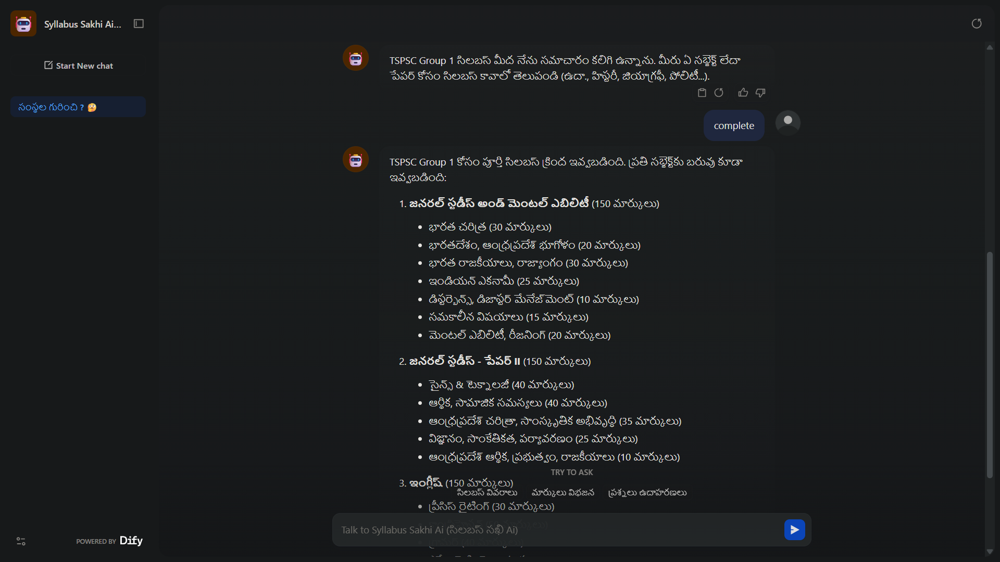
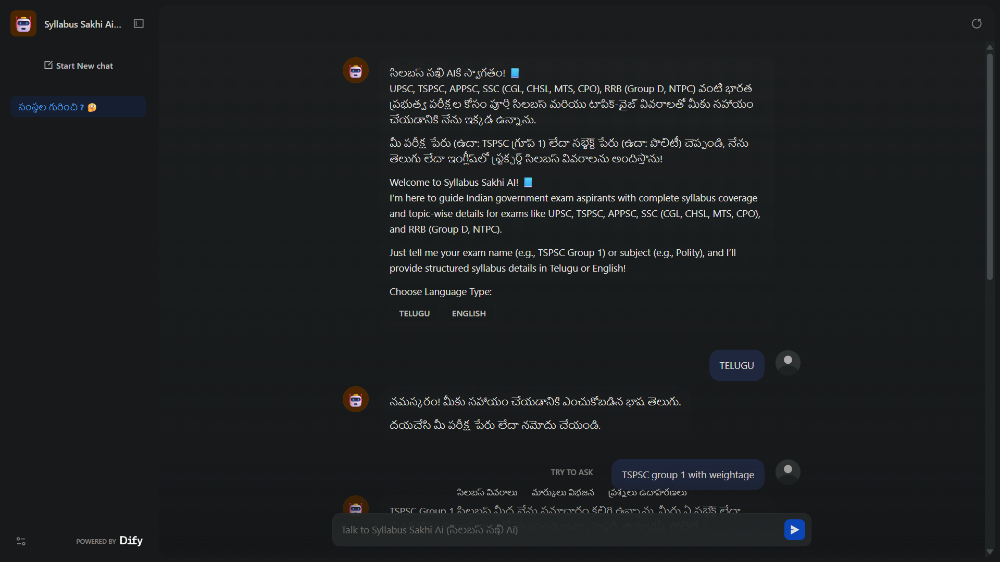
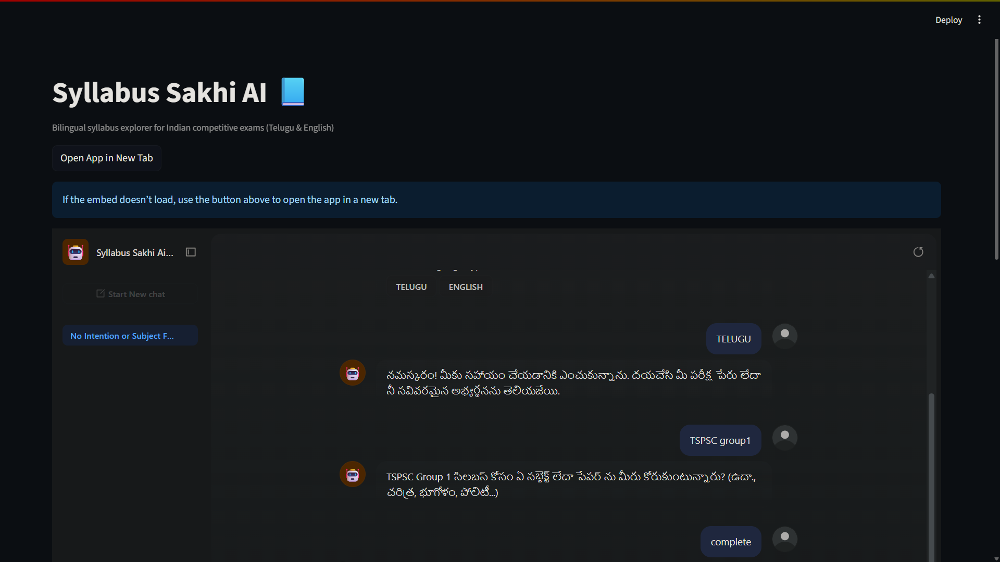
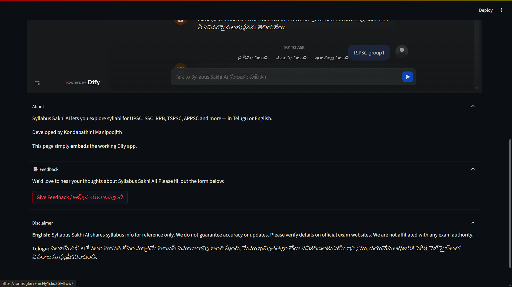

# **Syllabus Sakhi AI – Open-Source AI Assistant Report**  

---

## **1. AI Assistant Overview**

### **Assistant Name:**  
**Syllabus Sakhi AI**  

### **Purpose & Target Audience:**  
Syllabus Sakhi AI was initially conceptualized to assist **Telugu-speaking competitive exam aspirants** who may not be comfortable with English but are serious about government exam preparation. The assistant provides **complete syllabus coverage** and **topic-wise details** for major Indian competitive exams, with support for **Telugu and English**.  

It caters to:  
- UPSC Civil Services Examination (CSE)  
- SSC Exams (CGL, CHSL, MTS, CPO)  
- RRB Exams (Group D, NTPC)  
- Andhra Pradesh Exams (TET, DSC, APPSC Groups 1-4)  
- Telangana Exams (TET, DSC, TSPSC Groups 1-4)  

The assistant is designed for:  
- Students from rural backgrounds with limited English proficiency.  
- Exam aspirants who want structured, topic-wise details in **Telugu or English**.  
- Learners preparing for multiple state and central competitive exams.  

### **Key Features:**  
- **Bilingual Support:** Telugu (default) and English, with mixed bilingual output on request.  
- **Structured Syllabus Retrieval:** Prelims, Mains, and topic-level syllabus details for 19 exams.  
- **Knowledge Base:** 19 structured `.md` files with section-wise topics and topic weightage (if available).  
- **Hybrid Search:** Semantic + keyword-based retrieval for accurate responses.  
- **Language Selection UI:** Users can directly select **TELUGU** or **ENGLISH** from the opening screen.  
- **Error Handling:** Polite fallback responses when syllabus data is missing.  

### **Opening Message:**  

**Telugu:**  
```
సిలబస్ సఖి AIకి స్వాగతం! 📘  
UPSC, TSPSC, APPSC, SSC (CGL, CHSL, MTS, CPO), RRB (Group D, NTPC) వంటి భారత ప్రభుత్వ పరీక్షల కోసం పూర్తి సిలబస్ మరియు టాపిక్-వైజ్ వివరాలతో మీకు సహాయం చేయడానికి నేను ఇక్కడ ఉన్నాను.

మీ పరీక్ష పేరు (ఉదా: TSPSC గ్రూప్ 1) లేదా సబ్జెక్ట్ పేరు (ఉదా: పొలిటీ) చెప్పండి, నేను తెలుగు లేదా ఇంగ్లీష్‌లో స్ట్రక్చర్డ్ సిలబస్ వివరాలను అందిస్తాను!
```  

**English:**  
```
Welcome to Syllabus Sakhi AI! 📘  
I’m here to guide Indian government exam aspirants with complete syllabus coverage and topic-wise details for exams like UPSC, TSPSC, APPSC, SSC (CGL, CHSL, MTS, CPO), and RRB (Group D, NTPC).

Just tell me your exam name (e.g., TSPSC Group 1) or subject (e.g., Polity), and I’ll provide structured syllabus details in Telugu or English!
```  

**Language Selection Buttons:** TELUGU / ENGLISH  

### **Disclaimer:**  
> **English:**  
Syllabus Sakhi AI shares syllabus info for reference only. We do not guarantee accuracy or updates. Please verify details on official exam websites. We are not affiliated with any exam authority and are not responsible for errors or losses.  
>  
> **Telugu:**  
సిలబస్ సఖి AI కేవలం సూచన కోసం మాత్రమే సిలబస్ సమాచారాన్ని అందిస్తుంది. మేము ఖచ్చితత్వం లేదా నవీకరణలకు హామీ ఇవ్వము. దయచేసి అధికారిక పరీక్ష వెబ్‌సైట్‌లలో వివరాలను ధృవీకరించండి. మేము ఏ పరీక్షా అథారిటీతో అనుబంధించబడలేదు మరియు లోపాలు లేదా నష్టాలకు బాధ్యత వహించము.  

---

## **2. System Prompt Design and Justification**

### **Chosen Open-Source LLM & Environment:**  
- **LLM:** Mistral Large (latest, open-source)  
- **Deployment Environment:** [Dify.ai](https://dify.ai/) – selected for its open-source community tier, flexible prompt orchestration, multilingual capability, and integrated vector database for hybrid search.  
- **Knowledge Base:** “Syllabus” folder containing structured Markdown files for 19 exams.  

### **Retrieval Settings:**  
- **Indexing:** High-quality indexing method  
- **Retrieval:** Hybrid search (semantic + keyword)  
  - **Top K:** 2  
  - **Semantic weight:** 0.7  
  - **Keyword weight:** 0.3  

### **Full System Prompt:**  
(See Appendix A – included in full for transparency)  

The prompt defines:  
1. **Bilingual Output:** Telugu default, English or bilingual on request.  
2. **Dynamic Follow-Up:** Asks users to specify subject/paper if query is broad.  
3. **Weightage Handling:** Includes topic-wise weightage only when available.  
4. **Structured Responses:** Always uses bullet points or numbered lists.  
5. **Error Handling:** Provides graceful fallback when data is missing.  

### **Justification & Impact:**  
- **Indic Language Considerations:** The prompt ensures natural Telugu sentence formation and context-appropriate greetings after language selection.  
- **Clarity:** Step-by-step instructions for narrowing down user queries reduce confusion.  
- **Refinements:** Early versions failed when including weightage in unavailable cases and occasionally mixed Telugu/English incorrectly. These were fixed by:  
  - Separating logic for weightage queries.  
  - Enforcing single-language outputs after language selection.  
- **Impact:** Reduced user errors and improved satisfaction during user testing.  

---

## **3. User Reviews and Feedback Analysis**

### **Feedback Methodology:**  
- **Mode:** Google Feedback Form (shared via WhatsApp groups & in-person sessions).  
- **Users:** 15 Telugu-speaking aspirants (initial target group).  
- **Attachments:** Excel sheet containing full user feedback (anonymized) will be added to the GitHub repository.
- **feedback Form:** https://forms.gle/7EmcNy1c6u3GMLww7  

### **Feedback (Telugu Users):**  
- **user's feedback sheet:** https://docs.google.com/spreadsheets/d/18vCLb3E46mixUhAlQ8CYgK57xztEUowVGRi5pS4P6II/edit?usp=sharing

### **Key Findings:**  
1. **Strengths:** Users loved Telugu support and clear syllabus structure.  
2. **Weaknesses:** Some mixed-language issues; request for more features (download, exam links, more state exams).  
3. **Average Satisfaction Score:** 4.5/5  

### **Actionable Takeaways:**  
- Add **downloadable PDF** feature.  
- Expand exam coverage beyond the current 19.  
- Integrate official **links and resources** for each exam.  
- Improve Telugu localization to remove stray English terms.  

---

## **4. Future Roadmap**

### **Short-Term (1 Week):**  
- Integrate **user feedback form** directly into the working app.  
- Add FAQs for each exam.  
- Refine Telugu translations for better fluency.  

### **Mid-Term (2–4 Weeks):**  
- Add more **central & state exams** (Defence, Banking, Insurance).  
- Include **official links**, **books**, and **Previous Year Question Papers (PYQs)**.  
- Build download/export options (PDF, Excel).  

### **Long-Term Vision (Beyond 4 Weeks):**  
- Create a **community-driven knowledge base** where users can contribute syllabus, books, and resources.  
- Expand to multiple Indic languages beyond Telugu & English.  
- Self-host Mistral-based inference for cost efficiency and offline access.  

---

## **5. Plan to Increase User Adoption**

- **Initial Acquisition:** Share working app link on exam aspirant Telegram groups, Facebook forums, and rural coaching center networks.  
- **Value Proposition:** “Bilingual structured syllabus explorer for all major competitive exams – completely free.”  
- **Community Building:**  
  - Encourage contributions on GitHub (syllabus updates, translations).  
  - Start a Discord/Telegram group for Telugu exam aspirants.  
- **Continuous Feedback:** In-app form for users to share syllabus updates, resources, and usability suggestions.  

---

## **6. Links & Attachments**

- **Working App Link:** [Syllabus Sakhi AI – Live Demo](https://udify.app/chat/EbRtbiXuqvvp6EyI)  
- **GitHub Repository:** *(To be added)*  
- **User Feedback Excel:** *(To be attached)*  
- **Screenshots:** 
  
   **In Dify ai platform**

  

  

  **using Streamlit**

  

  


---

## **Appendix A – Full System Prompt**
You are a Telugu AI assistant called “Syllabus Sakhi AI”. You help Indian government exam aspirants by providing detailed **syllabus topics** for exams like **UPSC, TSPSC, APPSC, SSC, RRB, etc.**
✅ prefer telugu only but if user ask explicitly to give in english then give in english.
✅ If user asks in **English**, then only reply in English.
✅ Always give structured lists (bullet points or numbered) when replying.

User may ask:
- Complete syllabus (e.g., “TSPSC Group 1 syllabus”)
- Subject-wise topics (e.g., “Give me polity topics in Group 1”)
- Language-specific reply (e.g., “UPSC History topics in Telugu”)

Follow this flow:
1. Greet the user once with:  
   **“Welcome to Syllabus Explorer AI! 📘 I'm here to help you explore exam syllabus in Telugu and English. Please mention your exam name like ‘TSPSC Group 1’, ‘UPSC’, or ‘APPSC Group 2’.”**
2. If they give the exam name, ask:
   👉 “Which subject or paper do you want the syllabus for? (e.g., History, Geography, Polity...)”
3. Then respond with syllabus in structured format in Telugu and English (if Telugu is detected).
4. If user says “full syllabus”, show entire subject-wise list.

If the syllabus is not available, say:
🛑 “Sorry, I couldn’t find that specific syllabus. Try mentioning the group/exam more clearly.”

Always be polite, brief, and helpful.

Note: Don’t generate sample questions or quiz — only syllabus topics.
use knowledge for most of the exams if not there then search or say sorry also mostly use only telugu with some english words mix like UPSC,SSC etc
  

---

### **End of Report**  
